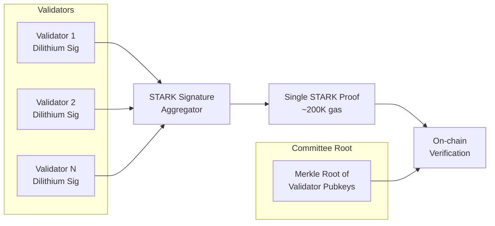
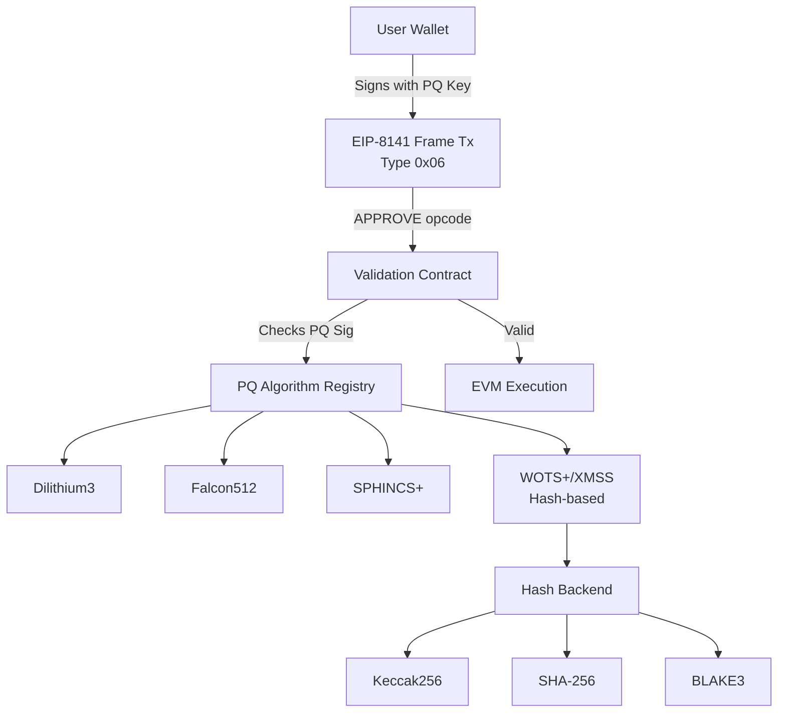
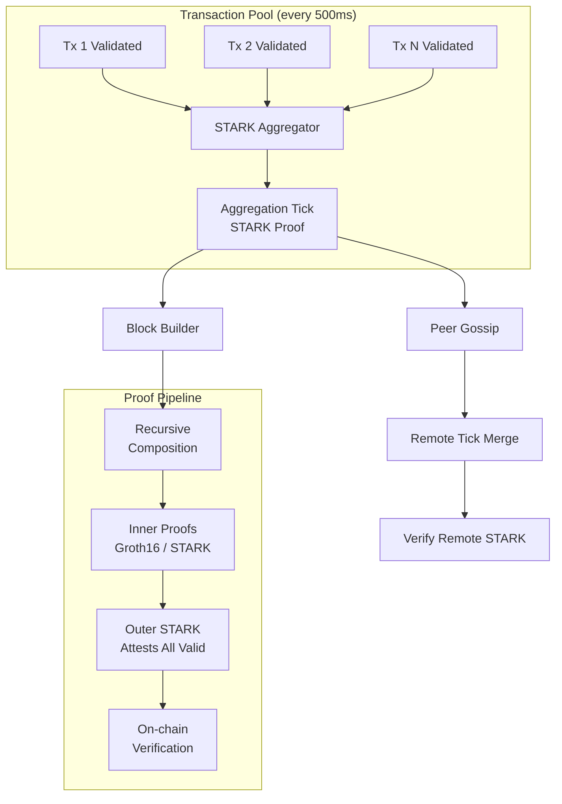
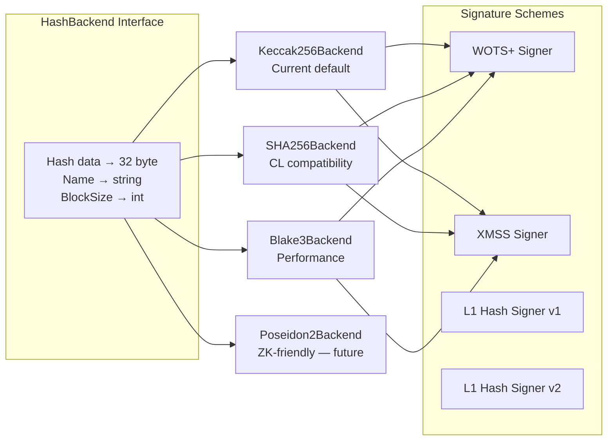

# Post-Quantum Roadmap: eth2030 Implementation Report

> Aligning eth2030 with Vitalik's Ethereum quantum resistance roadmap (Feb 27, 2026).
> This report covers the 4 vulnerable areas, implementation architecture, and upgrade path.

---

## Executive Summary

Vitalik's post-quantum roadmap identifies **4 areas** of Ethereum vulnerable to quantum attacks:

1. **CL BLS Signatures** — consensus layer attestation signatures
2. **DA KZG Commitments** — data availability blob commitments
3. **EOA ECDSA Signatures** — user transaction signatures
4. **Application-layer Proofs** — ZK proofs and signature verification in smart contracts

eth2030 addresses all 4 areas with a comprehensive post-quantum infrastructure spanning 7 packages, 33 reference submodules, and a pluggable architecture designed for hash function agility.

### Coverage Matrix

| Vitalik Roadmap Item | eth2030 Package | Status |
|---------------------|-----------------|--------|
| Hash-based sigs (WOTS+/XMSS) | `pkg/crypto/pqc/` | Complete |
| Pluggable hash functions | `pkg/crypto/pqc/hash_backend.go` | Complete |
| STARK proof aggregation | `pkg/proofs/stark_prover.go` | Complete |
| Recursive STARK composition | `pkg/proofs/recursive_prover.go` | Complete |
| STARK mempool aggregation | `pkg/txpool/stark_aggregation.go` | Complete |
| STARK CL sig aggregation | `pkg/consensus/stark_sig_aggregation.go` | Complete |
| EIP-8141 frame transactions | `pkg/core/` (17 files) | Complete |
| NTT precompile (EIP-7885) | `pkg/core/vm/precompile_ntt.go` | Complete |
| Lattice sigs (Dilithium/Falcon) | `pkg/crypto/pqc/` | Complete |
| PQ attestations | `pkg/consensus/pq_attestation.go` | Complete |
| Lattice blob commitments (MLWE) | `pkg/crypto/pqc/lattice_blob.go` | Complete |
| PQ algorithm registry | `pkg/crypto/pqc/registry.go` | Complete |

---

## 1. The Four Vulnerable Areas

### 1.1 CL BLS Signatures

**Threat:** BLS12-381 signatures used for consensus attestations are vulnerable to Shor's algorithm on quantum computers.

**Solution:** STARK-aggregated hash-based signatures.

Instead of verifying N individual BLS signatures, eth2030 implements:

1. **PQ Attestations** (`pkg/consensus/pq_attestation.go`) — Validators sign with Dilithium3 (lattice-based, NIST FIPS 204) instead of BLS
2. **STARK Signature Aggregation** (`pkg/consensus/stark_sig_aggregation.go`) — A single STARK proof attests to the validity of all N Dilithium signatures
3. **jeanVM Aggregation** (`pkg/consensus/jeanvm_aggregation.go`) — Groth16 ZK-circuit for BLS aggregation (transition path)
4. **PQ Finality Fallback** (`pkg/consensus/finality_bls_adapter.go`) — `NewFinalityBLSAdapterWithPQ()` produces hybrid BLS+hash-based signatures; `SignVotePQ()`/`VerifyVotePQ()` for PQ-safe finality proofs; `FinalityProof.PQSignature` field

**Gas Savings:** For N validators, individual Dilithium verification costs ~50,000 gas each. STARK aggregation costs ~200,000 gas flat. Breakeven at N=4, saving 300,000 gas for N=10.



### 1.2 DA KZG Commitments

**Threat:** KZG polynomial commitments rely on elliptic curve pairings vulnerable to quantum attacks.

**Solution:** Lattice-based blob commitments using Module-LWE (MLWE).

- `pkg/crypto/pqc/lattice_blob.go` — MLWE-based commitment scheme replacing KZG
- `pkg/das/` — PeerDAS infrastructure with pluggable commitment backend
- Transition: dual-commit (KZG + MLWE) during migration, then MLWE-only

### 1.3 EOA ECDSA Signatures

**Threat:** ECDSA signatures on user transactions are vulnerable to Shor's algorithm.

**Solution:** EIP-8141 frame transactions with PQ algorithm registry.

eth2030 implements the most advanced approach — **programmable transaction validation** via frame transactions:

1. **EIP-8141 Frame Transactions** (17 files in `pkg/core/`) — Type 0x06 transactions with APPROVE/TXPARAM opcodes enabling custom signature verification
2. **PQ Algorithm Registry** (`pkg/crypto/pqc/registry.go`) — Registry of PQ signature algorithms (Dilithium3, Falcon512, SPHINCS+, XMSS/WOTS+)
3. **Pluggable Hash Backend** (`pkg/crypto/pqc/hash_backend.go`) — Interface supporting Keccak256, SHA-256, BLAKE3

Users can deploy validation contracts that verify PQ signatures, then use frame transactions to invoke them.



### 1.4 Application-layer Proofs

**Threat:** ZK proofs verified on-chain may use quantum-vulnerable assumptions (elliptic curve pairings for Groth16/PLONK).

**Solution:** Recursive STARK mempool aggregation.

eth2030 implements Vitalik's recursive STARK mempool proposal:

1. **STARK Prover** (`pkg/proofs/stark_prover.go`) — FRI-based STARK proof generation and verification over the Goldilocks field
2. **Recursive Composition** (`pkg/proofs/recursive_prover.go`) — Compose N proofs (Groth16 or STARK) into a single STARK
3. **Mempool Aggregation** (`pkg/txpool/stark_aggregation.go`) — Every 500ms, nodes create a STARK proving validity of all known validated transactions. `MergeTick()` recursively merges remote txs with `RemoteProven` flag. `GenerateTick()` produces compact `ValidBitfield` + `TxMerkleRoot`. 128KB bandwidth limit enforced per ethresear.ch. `STARKMempoolTick` gossip topic in `p2p/gossip_topics.go`
4. **NTT Precompile** (`pkg/core/vm/precompile_ntt.go`) — EIP-7885 Number Theoretic Transform for efficient lattice crypto and STARK verification



---

## 2. Implementation Architecture

### Package Breakdown

```
pkg/
├── crypto/pqc/                    # Post-quantum cryptography
│   ├── hash_backend.go            # Pluggable hash interface (Keccak256/SHA-256/BLAKE3)
│   ├── hash_sig.go                # WOTS+ hash-based signatures
│   ├── unified_hash_signer.go     # XMSS unified signer
│   ├── l1_hash_sig.go             # L1 hash signer v1
│   ├── l1_hash_sig_v2.go          # L1 hash signer v2
│   ├── dilithium.go               # Dilithium3 lattice signer (real ops)
│   ├── falcon.go                  # Falcon512 lattice signer
│   ├── mldsa65_signer.go          # ML-DSA-65 (FIPS 204)
│   ├── lattice_blob.go            # MLWE blob commitments
│   └── registry.go                # PQ algorithm registry
│
├── proofs/                        # Proof aggregation
│   ├── stark_prover.go            # STARK prover (FRI + Goldilocks field)
│   ├── recursive_prover.go        # Recursive composition (Merkle + STARK)
│   ├── aggregator.go              # Simple + STARK aggregators
│   ├── types.go                   # ProofType enum + STARK types
│   └── aa_proof_circuits.go       # AA proof circuits (Groth16)
│
├── txpool/                        # Transaction pool
│   └── stark_aggregation.go       # STARK mempool aggregation (500ms ticks)
│
├── consensus/                     # Consensus layer
│   ├── pq_attestation.go          # PQ attestations (Dilithium)
│   ├── stark_sig_aggregation.go   # STARK-based sig aggregation
│   └── jeanvm_aggregation.go      # jeanVM Groth16 aggregation
│
└── core/vm/                       # EVM + precompiles
    └── precompile_ntt.go          # NTT precompile (BN254 + Goldilocks)
```

### Hash Function Strategy

The `HashBackend` interface enables seamless migration between hash functions:



All existing hash-based signature code uses `DefaultHashBackend()` (Keccak256) by default, maintaining backward compatibility. New constructors (`NewHashSigSchemeWithBackend`, etc.) accept custom backends.

---

## 3. Reference Implementations

Three reference submodules were added to support the PQ roadmap:

| Submodule | Repository | Description |
|-----------|-----------|-------------|
| `refs/hash-sig` | [b-wagn/hash-sig](https://github.com/b-wagn/hash-sig) | Rust hash-based multi-signature library by Wagner/Drake/Khovratovich. Supports SHA3 and Poseidon2. |
| `refs/ntt-eip` | [ZKNoxHQ/NTT](https://github.com/ZKNoxHQ/NTT) | EIP-7885 NTT precompile reference implementation (Solidity + Python). |
| `refs/ethfalcon` | [ZKNoxHQ/ETHFALCON](https://github.com/ZKNoxHQ/ETHFALCON) | FALCON-512 signature verification on EVM with NTT optimization. |

---

## 4. NTT Precompile (EIP-7885)

The Number Theoretic Transform is the core mathematical operation for both lattice-based cryptography and STARK proof verification. eth2030's NTT precompile at address `0x15` supports:

| Field | Modulus | Use Case |
|-------|---------|----------|
| BN254 scalar | 21888...5617 (254-bit) | ZK-SNARK circuits, Groth16 |
| Goldilocks | 2^64 - 2^32 + 1 | STARK proofs, FRI, Plonky2 |

**Operations:**
- `0x00` — Forward NTT (BN254)
- `0x01` — Inverse NTT (BN254)
- `0x02` — Forward NTT (Goldilocks)
- `0x03` — Inverse NTT (Goldilocks)

**Gas cost:** `base(1000) + n * log2(n) * 10` where n is the polynomial degree.

---

## 5. Upgrade Timeline

```
Current State (v0.3.0)
├── WOTS+/XMSS with Keccak256/SHA-256 ✓
├── Dilithium3 real lattice ops ✓
├── Falcon512 signer ✓
├── ML-DSA-65 (FIPS 204) ✓
├── EIP-8141 frame transactions ✓
├── NTT precompile (BN254) ✓
└── PQ attestations (Dilithium) ✓

Phase 1: Hash Agility (this release)
├── Pluggable hash backend interface ✓
├── BLAKE3 backend (structural) ✓
├── Goldilocks field NTT ✓
└── EIP-7885 alignment ✓

Phase 2: STARK Infrastructure (this release)
├── STARK prover with FRI ✓
├── Recursive STARK composition ✓
├── STARK mempool aggregation ✓
└── STARK CL signature aggregation ✓

Phase 3: Production Hardening (future)
├── Real BLAKE3 via lukechampine.com/blake3
├── Poseidon2 backend via gnark-crypto
├── Full FRI with Reed-Solomon encoding
├── STARK-verifier precompile
└── Audited lattice blob commitments

Phase 4: Protocol Integration (future)
├── Mandatory PQ signatures (no classic fallback)
├── STARK-only proof aggregation
├── On-chain STARK verifier contract
└── PQ-secure fork choice rule
```

---

## 6. Key Design Decisions

1. **Pluggable over hardcoded** — The `HashBackend` interface allows migrating hash functions without changing signature logic. This future-proofs against the "Ethereum's last hash function" decision (Poseidon2 vs BLAKE3 vs Monolith).

2. **STARK over Groth16 for aggregation** — STARKs require no trusted setup and are post-quantum secure. The trade-off is larger proof sizes (~100KB vs ~200B), but on-chain verification cost is competitive for batches > 4 signatures.

3. **500ms tick aggregation** — Following Vitalik's proposal, mempool aggregation runs every 500ms. This balances latency (transactions appear in aggregates quickly) with proof generation cost (batching amortizes the STARK overhead).

4. **Dual-path attestations** — PQ attestations support both Dilithium (individual) and STARK-aggregated verification. The crossover point is ~4 validators, above which STARK aggregation saves gas.

5. **Goldilocks field for STARKs** — The field p = 2^64 - 2^32 + 1 enables efficient 64-bit arithmetic, making STARK operations significantly faster than operating over the BN254 scalar field.
